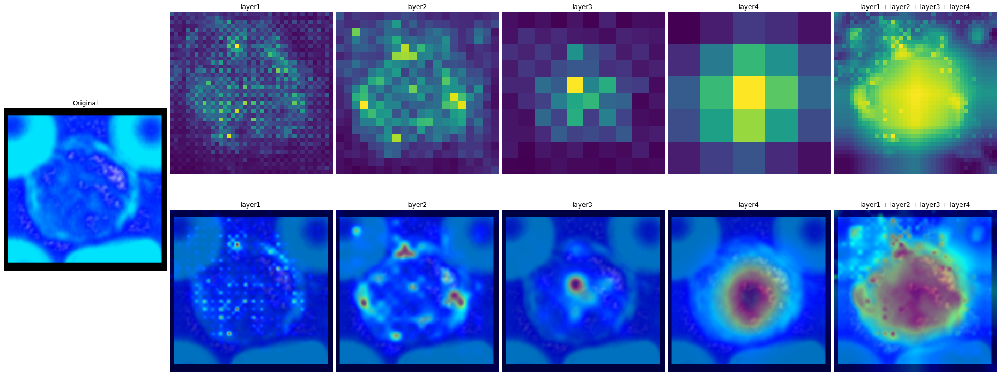
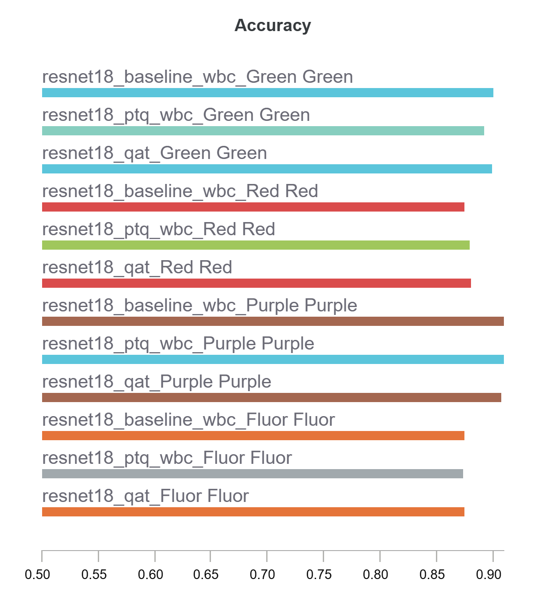
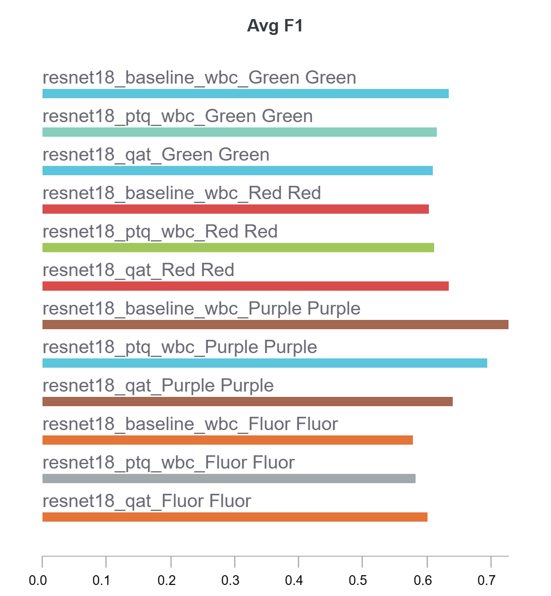
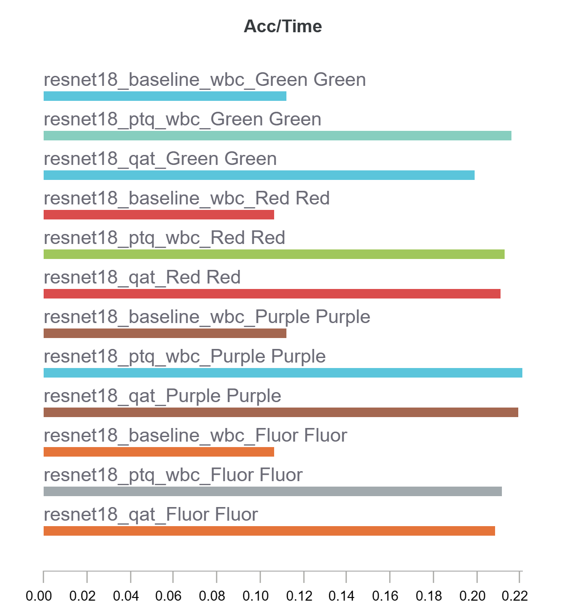

# White Blood Cell Detection & Classification

## Classification
placeholder discription

**Network saliency visualisation for ResNet18**

WBC classified as Neutrophil with 99% confidence.
(Image hue has been shifted)

### Quantization for WBC Classification

#### PTQ & QAT on ResNet18, ResNet34, ResNet50 and MobileNetV2
##### ResNet18 Results Summary

Full Results: https://wandb.ai/zarred/Baseline%20Training/reports/PTQ-QAT-Results--VmlldzoxMjY1MDE2

### Main Findings
- QAT provides limited advantage over PTQ for ResNet Models but recovers more predictive performance for MobileNetV2 because of the inclusion of depthwise seperable layers.
- ResNet18 with quantization seems to provide the best balance of accuracy to inference speed.
