# Efficient White Blood Cell Detection & Classification

## Introduction
HemoVision, in collaboration with Monash Medical AI Group (MMAI), are developing a portable, point-of-care analyzer that can provide a complete blood count (CBC) in 5 minutes. Part of the CBC is the white blood cell (WBC) differential. This is a count of each of the different white blood cells and is crucial for diagnosing and monitoring many medical condition.

The device will use a digital microscope to produce multimodal fluorescence and bright-field images of a small blood sample, which will be sent to an embedded edge AI processor to perform detection and classification of the cells with convolutional neural networks.

On-device inference is required because of the privacy and security concerns associated with medical data, as well as the need to operate without an internet connection. For such edge applications, where performance is limited by power, memory and processing speed, low complexity neural networks are required to allow the data to be processed under the run-time requirements.

This project aims to reduce the computational complexity of CNN's for the classification and detection of WBC’s. We investigate quantization techniques and their impact on model performance and efficiency, as well as their viability for different low complexity network architectures.

## Dataset
Typically, Giemsa stained blood smear images are used for machine learning techniques. A sample of these images are shown below. The staining exposes clear cell morphological structures.
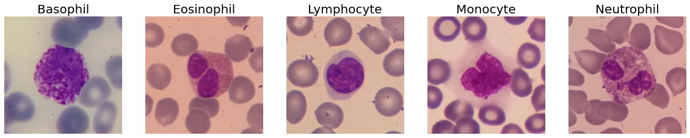
For fast and automated preparation, we use microscope images from 3 bright-field light sources and a fluorescent stain. Sample images of each cell type in each modality are shown below but have their hue shifted as per HemoVision's request.
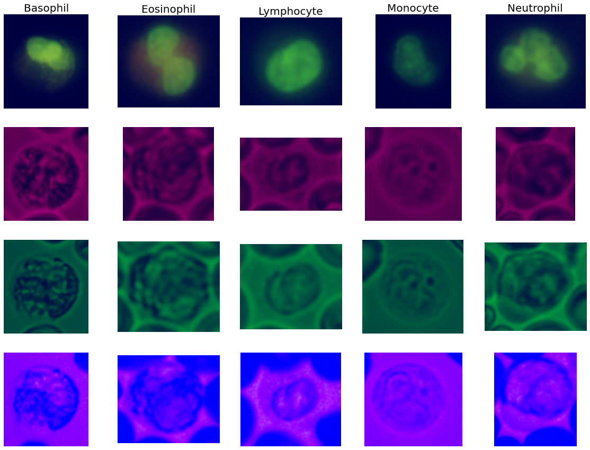
### Dataset distribution

**Train Folds**
| Folds | Basophil | Eosinophil | Lymphocyte | Monocyte | Neutrophil |
|:---:|:---:|:---:|:---:|:---:|:---:|
| 0 | 37 | 541 | 3558 | 99 | 7692 |
| 1 | 37 | 541 | 3558 | 99 | 7693 |
| 2 | 38 | 542 | 3558 | 99 | 7693 |
| 3 | 38 | 542 | 3559 | 99 | 7693 |
| 4 | 38 | 542 | 3559 | 100 | 7693 |

**Validation Folds**
| Folds | Basophil | Eosinophil | Lymphocyte | Monocyte | Neutrophil |
|:---:|:---:|:---:|:---:|:---:|:---:|
| 0 | 10 | 136 | 890 | 25 | 1924 |
| 1 | 10 | 136 | 890 | 25 | 1923 |
| 2 | 9 | 135 | 890 | 25 | 1923 |
| 3 | 9 | 135 | 889 | 25 | 1923 |
| 4 | 9 | 135 | 889 | 24 | 1923 |

## Baseline Experiments
**Colour Comparison**
Comparing performance across each modality we find that colour 1 produces the best results and fluorescent produces the worst using Resnet18 on an early version of the dataset.
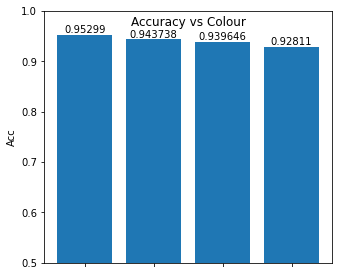 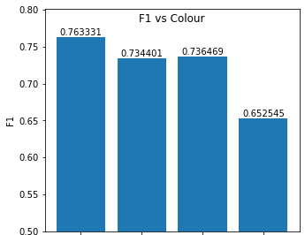

**Model Choice**
Analysis of different model performance show no benefit using large models like Resnet50 for this dataset. We choose to use efficiency focused models for fast runtime inference.

**Explainability**
By running class activation mapping (CAM) methods on a sample of our dataset, we are able to analyse what the network is "looking at". Below image shows a result of LayerCAM implemented with TorchCam, an open-source package available on GitHub. This provides a good sanity check that the model is learning to distinguish the morphological structures of the cells and not some other feature hidden to us.
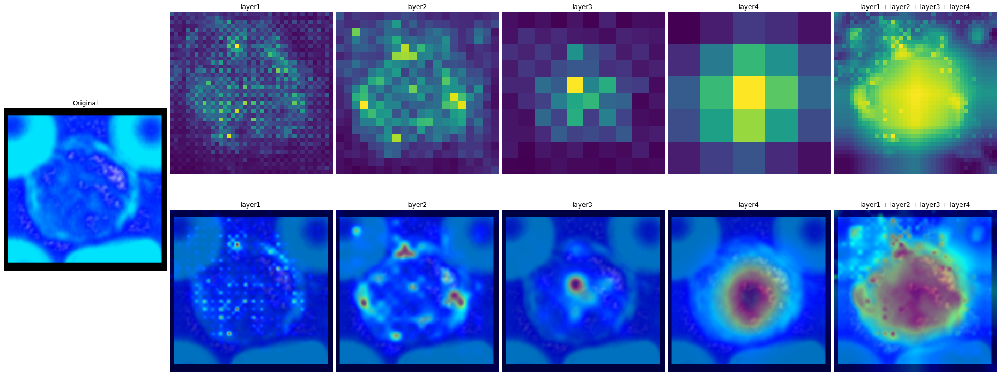
WBC classified as Neutrophil with 99% confidence. (Image hue has been shifted)

## Quantization
Quantization results achieved using pipelines in this repo.
### Classification
|  Architecture  | D-Type | Quant Method | Accuracy |   F1  | Speed (ms) 8 | Params | Size (MB) |
|:----------------:|:------:|:------------:|:--------:|:-----:|:------------:|:------:|:---------:|
|     Resnet18     |  FP32  |       -      |  95.24%  | 0.812 |      102     | 11.18M |    44.7   |
|     Resnet18     |  INT8  |      PTQ     |  94.72%  | 0.737 |      76      | 11.18M |    11.3   |
|     Resnet18     |  INT8  |      QAT     |  94.96%  |  0.75 |      76      | 11.18M |    11.3   |
| ShuffleNetv2 1.0 |  FP32  |       -      |  95.10%  |  0.73 |      31      | 2.278M |    5.2    |
| ShuffleNetv2 1.0 |  INT8  |PTQ Per Tensor|  88.01%  | 0.477 |      171     | 2.278M |    1.55   |
| ShuffleNetv2 1.0 |  INT8  |PTQ Per Channel|  94.64%  | 0.749 |      186     | 2.278M |    1.55   |
| ShuffleNetv2 1.0 |  INT8  |      QAT     |  79.01%  | 0.357 |      170     | 2.278M |    1.55   |
|    MobileNetv2   |  FP32  |       -      |  95.28%  |  0.77 |      67      | 2.230M |    8.92   |
|    MobileNetv2   |  INT8  |PTQ Per Tensor|  91.18%  |  0.66 |      31      | 2.230M |    2.65   |
|    MobileNetv2   |  INT8  |PTQ Per Channel|  94.45%  | 0.749 |      44      | 2.230M |    2.65   |
|    MobileNetv2   |  INT8  |      QAT     |  93.21%  | 0.663 |      32      | 2.230M |    2.65   |
|     MM-MIMO3     |  FP32  |       -      |  95.94%  | 0.789 |      167     | 21.32M |    85.3   |
|     MM-MIMO3     |  INT8  |      PTQ     |  94.79%  | 0.741 |      142     | 21.32M |    21.4   |
|     MM-MIMO3     |  INT8  |      QAT     |  91.44%  | 0.635 |      150     | 21.32M |    21.4   |
|   RegNet x400mf  |  FP32  |       -      |  94.88%  | 0.741 |      65      | 5.097M |    20.7   |
|   RegNet x400mf  |  INT8  |      PTQ     |  94.76%  | 0.741 |      33      | 5.097M |    5.25   |
|   MobileNetV3s   |  FP32  |       -      |  94.84%  | 0.732 |      23      | 1.522M |    6.22   |
|   MobileNetV3s   |  INT8  |      PTQ     |  75.97%  | 0.506 |      17      | 1.522M |    1.82   |
| ShuffleNetv2 0.5 |  FP32  |       -      |  94.25%  | 0.703 |      27      | 0.347M |    1.53   |
| ShuffleNetv2 0.5 |  INT8  |      PTQ     |  93.37%  | 0.682 |      30      | 0.347M |    0.54   |

### Detection
| Architecture | D-Type | mAP | Speed (ms)2 | Params | Size |
|:---:|:---:|:---:|:---:|:---:|:---:|
| YOLOv3 512×512 | FP32 | 0.645 | 2517 | 65.25M | 246 |
| YOLOv3 512×512 | INT8 | 0.643 | 1550 | 65.25M | 61.7 |

## Pruning

### Classification
|Local Pruning|Global Pruning|
|:---------------:|:------------:|
|Lowest magnitude weights of each tensor are pruned|Lowest magnitude weights of whole model are pruned|
|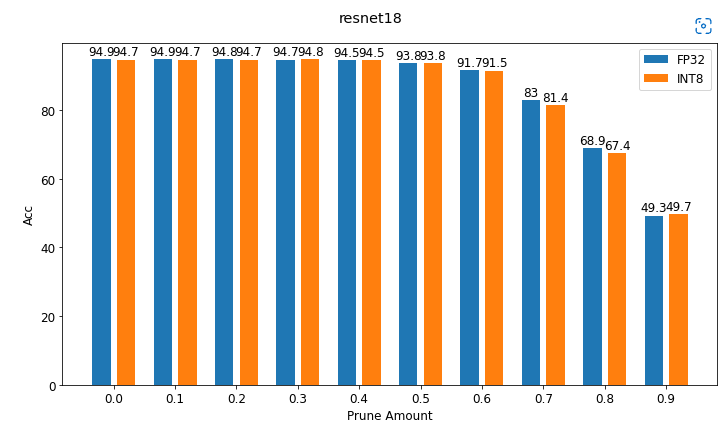|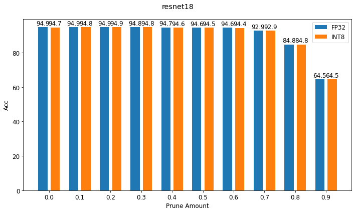|
|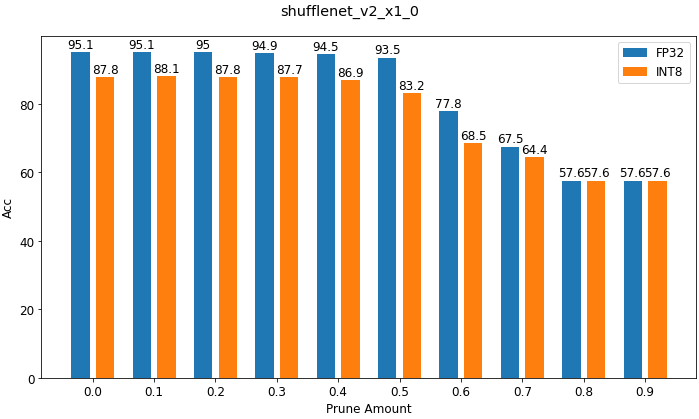|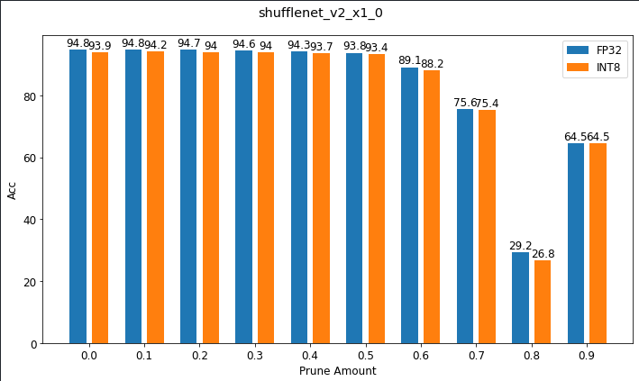|
||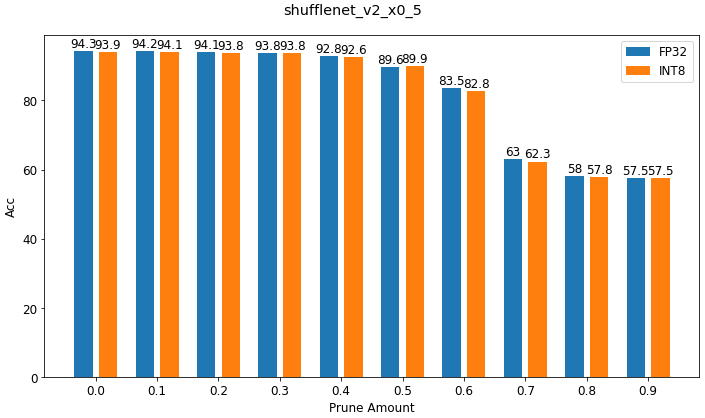|
|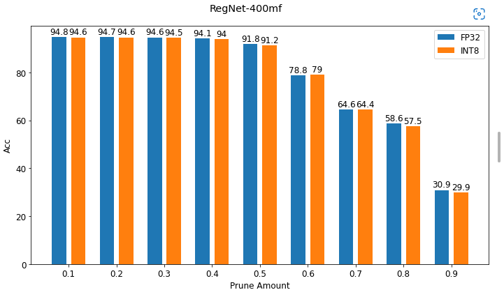|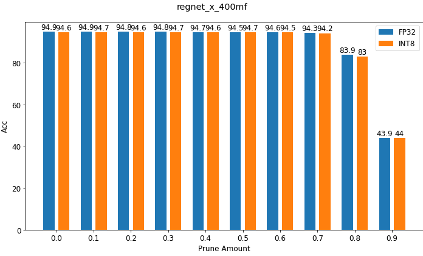|

### Detection

| Sparcity % | Class Acc | mAP   | AP-Bas | AP-Eos | AP-Lym | AP-Mon | AP-Neu |
|------------|-----------|-------|--------|--------|--------|--------|--------|
| 0          | 92.57     | 0.645 | 0.208  | 0.798  | 0.765  | 0.535  | 0.916  |
| 10         | 92.46     | 0.701 | 0.5    | 0.804  | 0.761  | 0.538  | 0.904  |
| 30         | 87.34     | 0.407 | 0      | 0.201  | 0.651  | 0.341  | 0.841  |
| 50         | 79.29     | 0.226 | 0      | 0.032  | 0.369  | 0.017  | 0.712  |